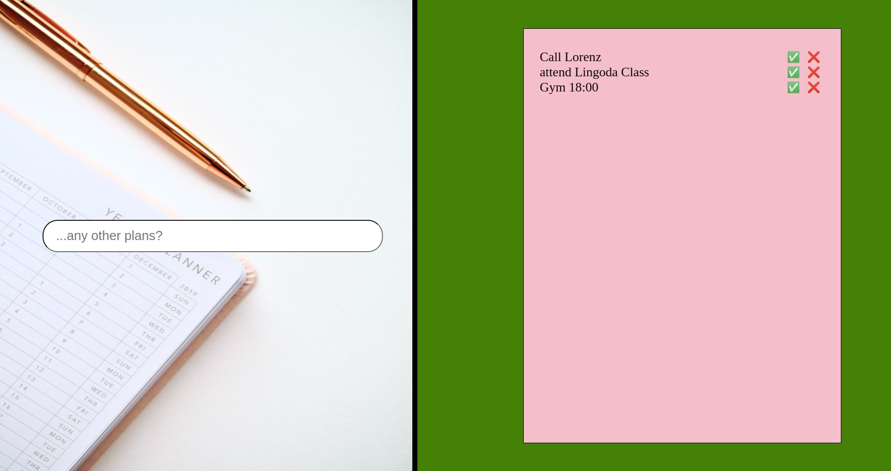

## To Do List 

#### About Project
In this application it is a to-do list. You can enter a task that you want to do in the input field. After entering the tasks will be added to the list.

**_[Here you can have a look at my work.](https://johnxadams.github.io/to-do-list/)_**

---

1. _After creating a basic HTML skeleton with form > input - the magic happens in java-script_

2. _Inside the arrow-Fn addToList I declared a variable called userdata, which captures the value of the users Input. Only if (user's input is not empty..) {..create a new element "newList"(li) and also create a new textNode. The textNode will be added to the newList(li) on each new input.} All the rest is mostly decoration._
---

##### Developed With

- [x] _HTML5_
- [x] _CSS3_
- [ ] _SASS_
- [ ] _SCSS_
- [x] _JavaScript_
- [ ] _React_
- [ ] _Bootstrap_
- [ ] _npm_

---

### Contact

Mail: <johnxadams93@gmail.com> 
GitHub: [johnxadams](https://github.com/johnxadams) 

---

### Used Tools

- [Visual Studio Code](https://code.visualstudio.com/)
- [ColorZilla](https://www.colorzilla.com/chrome/)
